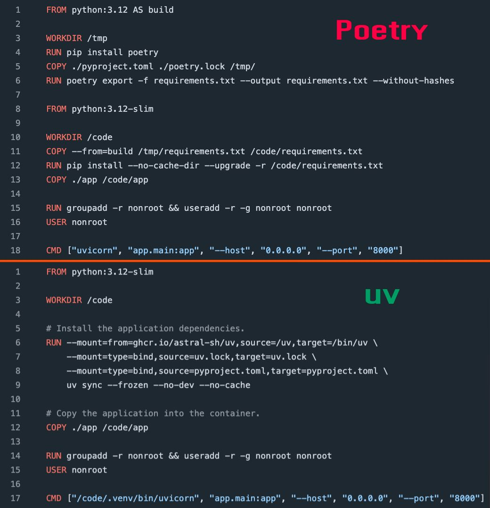

# { cybersoul } 
**Author:** Pablo Gomes Corrêa | 
**Date:** 28/02/2025


# Dashboard Financeiro
### Necessidades
- ~~Dólar em tempo real~~
- Cadastro de ativos para monitoramento e coleta de dados
- Previsão sobre lucros em investimentos com base nos dados de histórico
- ~~Verificar qual a melhor API para obter os dados de investimentos~~
- Envio de notificações por e-mail ao aumentar um ativo em 5% ou mais
- ~~Notícias sobre as ações na lista~~

### Dependências
- Streamlit
- CrewAI
- Base SQLite

### Instalação
```
python -m venv .venv
pip install -r requirements.txt
```

- CrewAI
```bash
  pip install 'crewai[tools]'
  pip show crewai
```

- Streamlit
```bash
  pip install streamlit
```

- Poetry
```bash
  curl -sSL https://install.python-poetry.org | python3 -
  poetry version
  poetry init
  poetry add streamlit
  poetry add 'crewai[tools]'
```

Executando o projeto com o poetry
```bash
   poetry run streamlit run app/dashboard.py
```

Docker


### APIs
- API de cotação do dolar: https://economia.awesomeapi.com.br/last/USD-BRL
- API de cotação do bitcoin: https://economia.awesomeapi.com.br/last/BTC-BRL
- API de cotação do solana: https://economia.awesomeapi.com.br/last/SOL-BRL
- API de cotação do Ouro: https://economia.awesomeapi.com.br/last/GOLD-BRL
- API de informações do yfinance em tempo real: https://yfapi.net/v6/finance/quote
